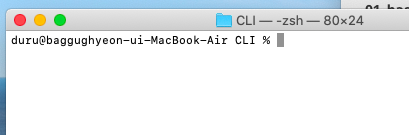

# Basic CLI

## 폴더 관련

디렉토리(directory)라고도 함

**폴더 상징 특수기호**

- `~`
  - Home 폴더
  - 위치는 /Users/duru
- `/`
  - 루트(root) 폴더를 의미
- `.`
- `..`


## 명령어

- `cd [대상폴더]` 
- `ls` 
- `rm` 
- `mkdir` 
- `touch` 


```python
def func(args) :
	print('hi')
```


## summary




